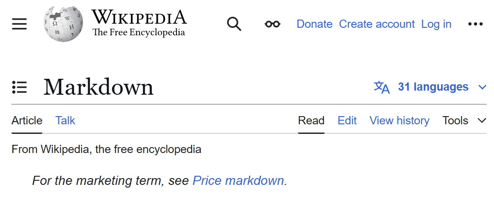

# Workshop 4

By: Siomonn Lunn

## Emphasis

_Markdown_ is a *lightweight markup language* for creating formatted text using a plain-text editor. John Gruber created Markdown in 2004 as an easy-to-read markup language. Markdown is widely used for blogging and instant messaging, and also used elsewhere in online forums, collaborative software, documentation pages, and readme files.

## Strong

The initial **description of Markdown contained** ambiguities and raised __unanswered questions__, causing implementations to both intentionally and accidentally diverge from the original version. This was addressed in 2014 when long-standing Markdown contributors released CommonMark, an unambiguous specification and test suite for Markdown.

## Lists

### Unordered Lists

- item 1
- item 2
    - sub item 1
    - sub item 2
- item 3

### Ordered Lists

1. item 1
2. item 2
    1. sub item 1
    2. sub item 2
3. item 3

## Images



## Hyperlinks

[Markdown wikipedia](https://en.wikipedia.org/wiki/Markdown)

## Including Code

### Inline Code

In HTML the `` || `img` tag is used to display pictures

### Code Fences

```html
<nav>
    <ul>
        <li><a href="index.html">Home</a></li>
        <li><a href="grid.html">Grid</a></li>
        <li><a href="https://trentu.ca">Trent</a></li>
        <li><a href="https://loki.trentu.ca">Loki</a></li>
    </ul>
</nav>
```

```css
body {
  font-family: system-ui, -apple-system, BlinkMacSystemFont, "Segoe UI", Roboto,
    Oxygen, Ubuntu, Cantarell, "Open Sans", "Helvetica Neue", sans-serif;
  height: 100vh;
  display: flex;
  flex-direction: column;
}
```